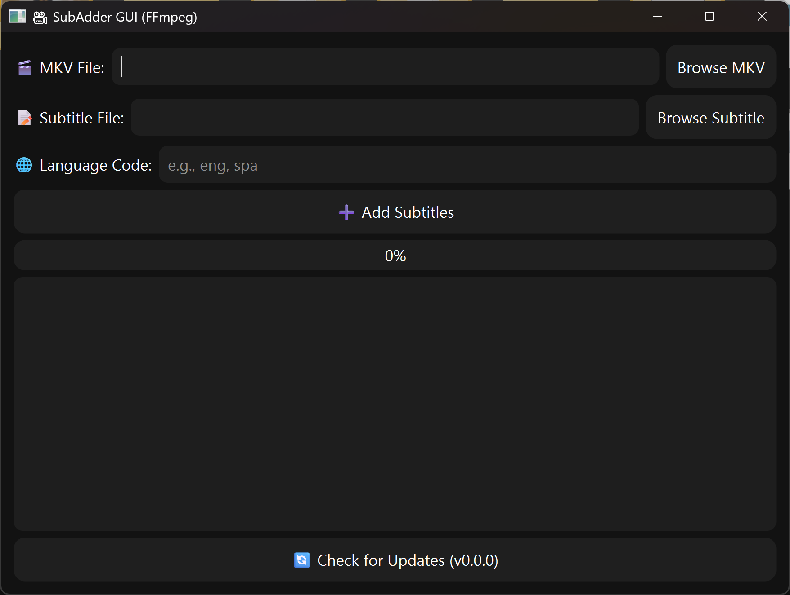

# SubAdderGUI

🎥 **SubAdderGUI**

[](https://github.com/hybridvamp/SubAdderGUI/releases)
[](LICENSE)
[](https://www.python.org/downloads/)
[](https://github.com/hybridvamp/SubAdderGUI/issues)

A sleek, modern Python application to add subtitle tracks to MKV files using FFmpeg. It supports drag-and-drop, automatic update checking, Git fallback, and a Material-UI-inspired interface.

🔔 **Stay updated**: [t.me/hybridupdates](https://t.me/hybridupdates)

---

## 🚀 Features

* ✅ Add new subtitle tracks to MKV files without altering existing ones.
* ✅ Supports multiple subtitle formats: `.srt`, `.ass`, `.sub`, `.pgs`.
* ✅ Modern dark mode interface with Material-UI styling.
* ✅ Drag & drop support for quick file selection.
* ✅ Automatic update checker (Git pull or ZIP fallback).
* ✅ Automatically downloads and configures FFmpeg if missing.
* ✅ Cross-platform (Windows, macOS, Linux).

---

## 📦 Requirements

* Python 3.8+
* Internet connection (for update checking and FFmpeg download)

### Python Dependencies

Listed in `requirements.txt`:

```
PyQt6
requests
```

Install them with:

```bash
pip install -r requirements.txt
```

---

## 🛠 Installation & Usage

### 1️⃣ Run the App

* Double-click `subs.py` (Python must be associated) or run:

```bash
python subs.py
```

If FFmpeg is not detected, it will automatically download and configure it in the app folder.

---

## 🔄 Update Checker

* The app includes a **Check for Updates** button.
* It uses `git pull` if cloned from GitHub or downloads a ZIP fallback.
* If up-to-date, the button will disable and show **✅ Up-to-date**.

---

## 📁 Project Structure

```
SubAdderGUI/
├── subs.py              # Main application
├── requirements.txt      # Python dependencies
├── version.txt           # Current version
└── README.md             # Project documentation
```

---

## 📜 License

MIT License © 2025 HybridVamp

---

## 🌐 Links

* [GitHub Repo](https://github.com/hybridvamp/SubAdderGUI)
* [FFmpeg Downloads](https://ffmpeg.org/download.html)
* [Telegram Channel](https://t.me/hybridupdates)

---

## 💡 Screenshots


